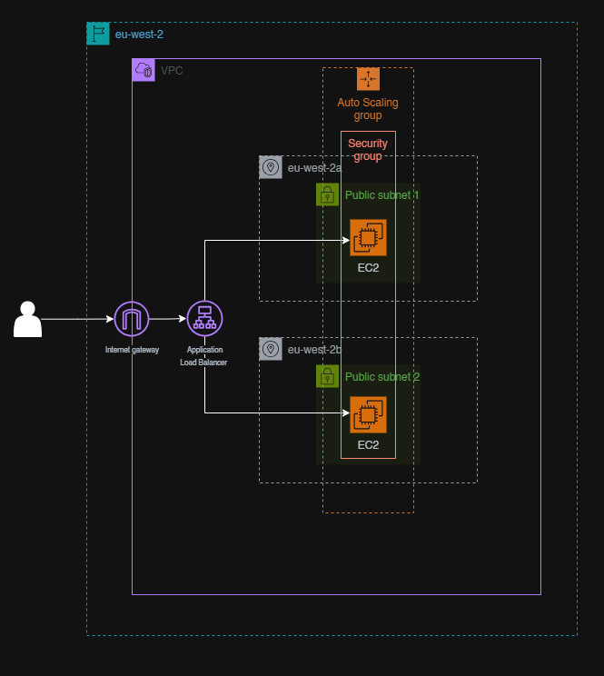

# Terraform AWS EC2 with Application Load Balancer

## Overview
This project demonstrates how to provision AWS infrastructure using Terraform. It creates an EC2 instance behind an Application Load Balancer (ALB) with Auto Scaling enabled.

## Architecture Diagram

## Features
- Creates a VPC, Subnets, and Internet Gateway
- Launches an EC2 instance with user data to run a web server
- Configures an Application Load Balancer across multiple subnets
- Auto Scaling Group for fault tolerance
- Security groups for network access control